# RISC-V Based MYTH Workshop

This repository documents the comprehensive logs, architectural deep-dives, and hands-on laboratory exercises completed during the RISC-V Based MYTH Workshop.

---

## RV Day 1 - Introduction to RISC-V ISA and GNU compiler toolchain

### RV-D1SK1 - Introduction to RISC-V basic keywords

#### RV_D1SK1_L1_Introduction
The workshop outlines the complete open-source chip design flow, illustrating the connection between high-level application software and structural silicon layout.

* **RISC-V Architecture:** Translates software programs (like a C code script) via a GNU toolchain compiler into localized hardware execution parameters using standard RISC-V assembly language instruction sets.
* **Hardware Implementation:** Utilizes a parameterized HDL description framework (such as the `picorv32` CPU core structure) to define the register logic gates.
* **Physical Layout:** Converts the verified RTL layout into discrete physical logic components (like standard cell blocks) via an open-source synthesis implementation runner (`qflow`).

##### 📸 Flow Mapping Output

*Figure 1: Complete hardware-software flow abstraction showing code processing levels from compiler execution down to structural standard cell layouts.*

---


## RV Day 3 - Digital Logic with TL- verilog code

### RV_D3SK1 - Digital Logic Design

### RV_D3SK1_L2 - Labs for sequential calculator

This laboratory exercise focuses on the design and verification of a **sequentail calculator** using **TL-Verilog** in the **Makerchip IDE**.

The calculator accepts two input values and performs four basic arithmetic operations:

- Addition
- Subtraction
- Multiplication
- Division

The operation is selected using a **2-bit encoded operation signal `$op[1:0]`**.

---

## 1. Sequential Calculator Specification

The sequential calculator consists of two 32-bit input operands and one 32-bit output.

The inputs are:

```text
$val1[31:0]
$val2[31:0]
```

The calculator performs four arithmetic operations in parallel:

```text
Addition       → $sum[31:0]
Subtraction    → $diff[31:0]
Multiplication → $prod[31:0]
Division       → $quot[31:0]
```

The `$op[1:0]` signal determines which operation result is selected and connected to `$out[31:0]`.

### Operation Encoding

| `$op[1:0]` | Operation |
|------------|-----------|
| `2'b00` | Addition |
| `2'b01` | Subtraction |
| `2'b10` | Multiplication |
| `2'b11` | Division |

Therefore:

```text
$op = 2'b00 → $out = $val1 + $val2

$op = 2'b01 → $out = $val1 - $val2

$op = 2'b10 → $out = $val1 * $val2

$op = 2'b11 → $out = $val1 / $val2
```

A division-by-zero condition is also handled in the design. If `$val2` is zero, the quotient is forced to zero.

### sequential Calculator Architecture

```text
                 ┌─────────────────┐
                 │    Addition     │
                 │  $val1+$val2    │
                 └────────┬────────┘
                          │
                 ┌────────▼────────┐
                 │   Subtraction   │
                 │  $val1-$val2    │
                 └────────┬────────┘
                          │
                 ┌────────▼────────┐
                 │ Multiplication  │
                 │  $val1*$val2    │
                 └────────┬────────┘
                          │
                 ┌────────▼────────┐
                 │     Division    │
                 │  $val1/$val2    │
                 └────────┬────────┘
                          │
                       $op[1:0]
                          │
                    ┌─────▼─────┐
                    │  4-to-1   │
                    │    MUX    │
                    └─────┬─────┘
                          │
                       $out[31:0]
```

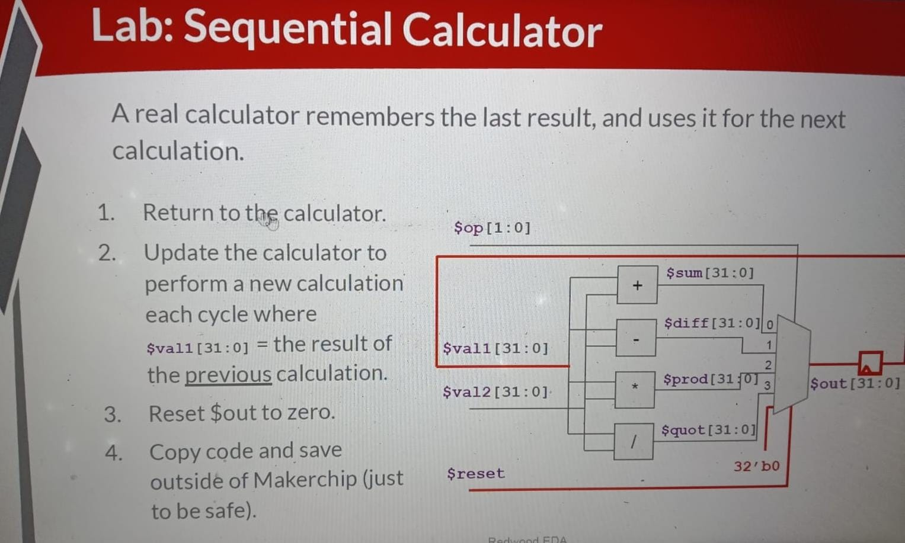

*Figure 1: RV_D3SK1_L3 laboratory specification showing the architecture of the combinational calculator and encoded operation selection.*

---


## 2. TL-Verilog Implementation

The third image shows the TL-Verilog implementation of the sequential calculator.

The test environment generates small random values using `$rand1[3:0]` and `$rand2[3:0]`.

These values are assigned to the 32-bit calculator operands.

### TL-Verilog Code

```tlv
|calc
    @0
        $val1[31:0] = $rand1[3:0];
        $val2[31:0] = $rand2[3:0];

        $sum[31:0]  = $val1 + $val2;
        $diff[31:0] = $val1 - $val2;
        $prod[31:0] = $val1 * $val2;

        $quot[31:0] = $val2 == 0 ? 32'd0 : $val1 / $val2;

        $out[31:0] =
            $op[1:0] == 2'b00 ? $sum :
            $op[1:0] == 2'b01 ? $diff :
            $op[1:0] == 2'b10 ? $prod :
                                $quot;

        // Assertions to end simulation
        *passed = *cyc_cnt > 40;
        *failed = 1'b0;
```

### Code Explanation

The first two statements assign the generated input values:

```tlv
$val1[31:0] = $rand1[3:0];
$val2[31:0] = $rand2[3:0];
```

The four arithmetic operations are then calculated:

```tlv
$sum[31:0]  = $val1 + $val2;
$diff[31:0] = $val1 - $val2;
$prod[31:0] = $val1 * $val2;
```

For division, a conditional operator is used:

```tlv
$quot[31:0] = $val2 == 0 ? 32'd0 : $val1 / $val2;
```

This prevents division by zero.

The final output is selected using `$op[1:0]`:

```tlv
$out[31:0] =
    $op[1:0] == 2'b00 ? $sum :
    $op[1:0] == 2'b01 ? $diff :
    $op[1:0] == 2'b10 ? $prod :
                        $quot;
```

This behaves like a **4-to-1 multiplexer**, where the operation selector chooses one of the four arithmetic results.

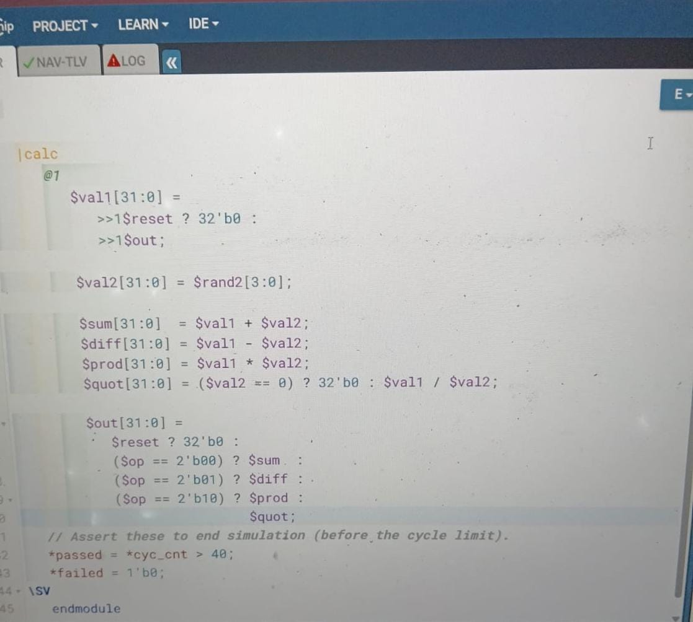

*Figure 2: TL-Verilog implementation showing the input assignment, arithmetic operations, division-by-zero protection, output selection, and simulation completion condition.*

---

## 3. Hardware Diagram

The fourth image shows the hardware diagram generated by Makerchip.

The diagram represents the logical structure of the calculator after the TL-Verilog description is elaborated.

The two inputs are connected to the arithmetic operations:

```text
$val1 ─────────┐
               ├──► Addition
$val2 ─────────┘

$val1 ─────────┐
               ├──► Subtraction
$val2 ─────────┘

$val1 ─────────┐
               ├──► Multiplication
$val2 ─────────┘

$val1 ─────────┐
               ├──► Division
$val2 ─────────┘
```

The four results are then controlled by `$op[1:0]`.

```text
             ┌───────────┐
$sum ───────►│           │
$diff ──────►│           │
$prod ──────►│  4-to-1   ├────► $out
$quot ──────►│    MUX    │
             │           │
$op ────────►│  Select   │
             └───────────┘
```

This demonstrates an important principle of sequential logic: **the output depends only on the current input values and control signals**.

There is no storage element or clock-dependent state required for the arithmetic calculation itself.

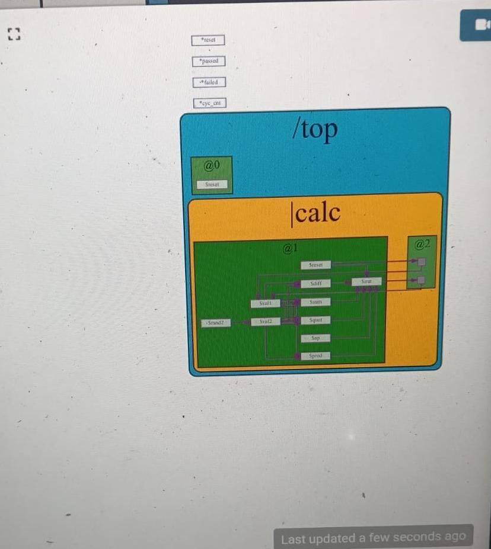

---

## 4. Waveform Verification

The waveform is used to verify the behavior of the calculator over multiple simulation cycles.

The important signals include:

| Signal | Description |
|--------|-------------|
| `$rand1` | First generated random input |
| `$rand2` | Second generated random input |
| `$val1` | First calculator operand |
| `$val2` | Second calculator operand |
| `$sum` | Addition result |
| `$diff` | Subtraction result |
| `$prod` | Multiplication result |
| `$quot` | Division result |
| `$op` | Operation selector |
| `$out` | Final calculator output |

The operation selection is:

```text
$op = 2'b00 → Addition

$op = 2'b01 → Subtraction

$op = 2'b10 → Multiplication

$op = 2'b11 → Division
```

For every simulation cycle, the selected operation determines the value appearing at `$out`.

For example, if:

```text
$val1 = 10
$val2 = 5
```

then:

```text
$op = 2'b00 → $out = 15

$op = 2'b01 → $out = 5

$op = 2'b10 → $out = 50

$op = 2'b11 → $out = 2
```

The waveform allows these relationships to be observed and verified directly.

### Simulation Completion

The simulation is terminated after the cycle counter exceeds 40:

```tlv
*passed = *cyc_cnt > 40;
*failed = 1'b0;
```

This indicates successful completion of the laboratory simulation.

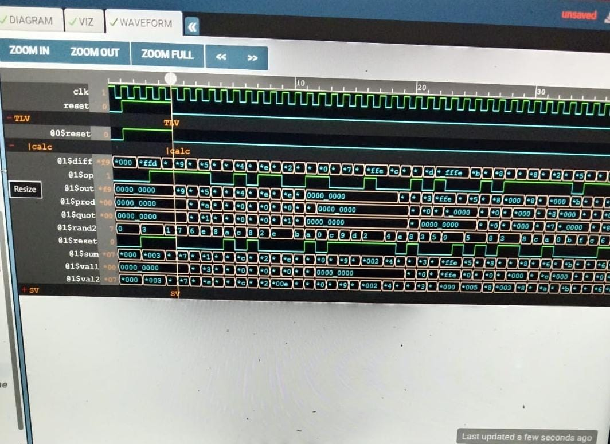

*Figure 4: Simulation waveform showing the calculator inputs, arithmetic results, operation selector, and final output during verification.*

---

## RV_D3SK1_L3_Labs - Combinational Logic

### RV_D3SK1_L3_Labs - Combinational Logic Laboratory

This laboratory focuses on the implementation and verification of combinational logic using a hardware description language and the Makerchip IDE. The laboratory demonstrates how mathematical operations can be converted into RTL logic, simulated, visualized, and verified.

---

### 1. Combinational Calculator Specification

The first image shows the **Combinational Calculator** laboratory specification and architecture.

The circuit implements four arithmetic operations on two input values:

- Addition
- Subtraction
- Multiplication
- Division

The operation is selected using the 2-bit control signal `$op[1:0]`.

| `$op[1:0]` | Operation |
|------------|-----------|
| `2'b00` | Addition (`$sum`) |
| `2'b01` | Subtraction (`$diff`) |
| `2'b10` | Multiplication (`$prod`) |
| `2 me/b11` | Division (`$quot`) |

The inputs `$val1[31:0]` and `$val2[31:0]` are zero-extended from 4-bit random values (`$rand1[3:0]`, `$rand2[3:0]`) to keep simulation values small and easy to verify. A 4-to-1 multiplexer selects the required output `$out[31:0]` based on `$op[1:0]`.

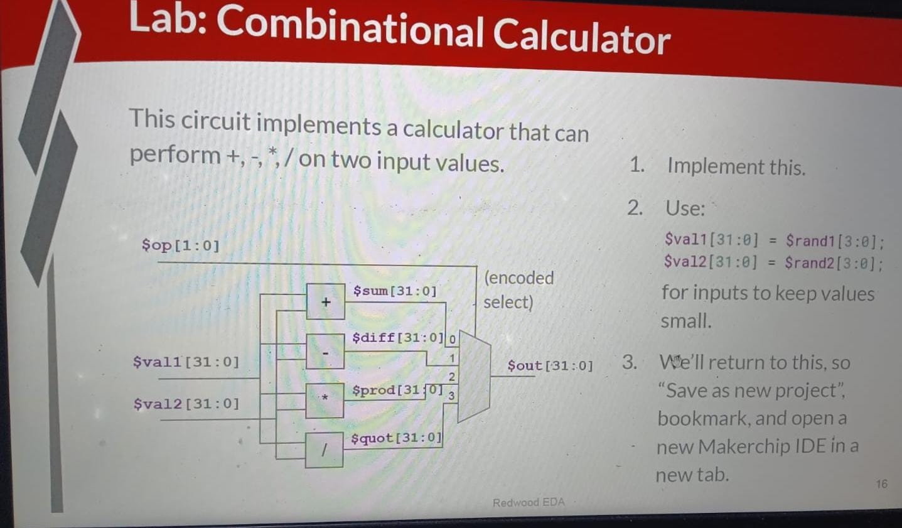

*Figure 1: RV_D3SK1_L3 combinational calculator specification showing arithmetic operations and encoded operation selection.*

---

### 2. Simulation Waveform Verification

The second image shows the **simulation waveform viewer** within the Makerchip IDE.

The waveform displays signal transitions across clock cycles (`clk`). As `$rand1`, `$rand2`, and `$op` change over time, intermediate signals (`$sum`, `$diff`, `$prod`, `$quot`) update concurrently. The viewer verifies that `$out` synchronously matches the selected mathematical result for each input vector.

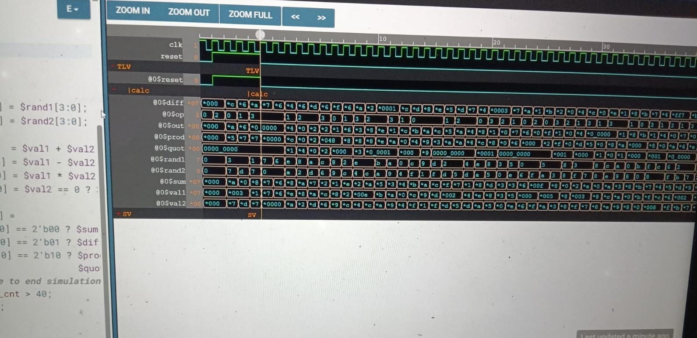

*Figure 2: Cycle-by-cycle simulation waveform verifying the combinational calculator output signals.*

---

### 3. Combinational Logic Diagram

The third image shows the generated **hardware architecture and logic diagram**.

The Makerchip **DIAGRAM** tab generates the structural hierarchy inside `/top` -> `|calc` at stage `@0`. The two inputs feed into the four parallel arithmetic blocks, and their results route into the central multiplexer block driving `$out`.

This visualization illustrates how the high-level TL-Verilog code translates into structural hardware elements.

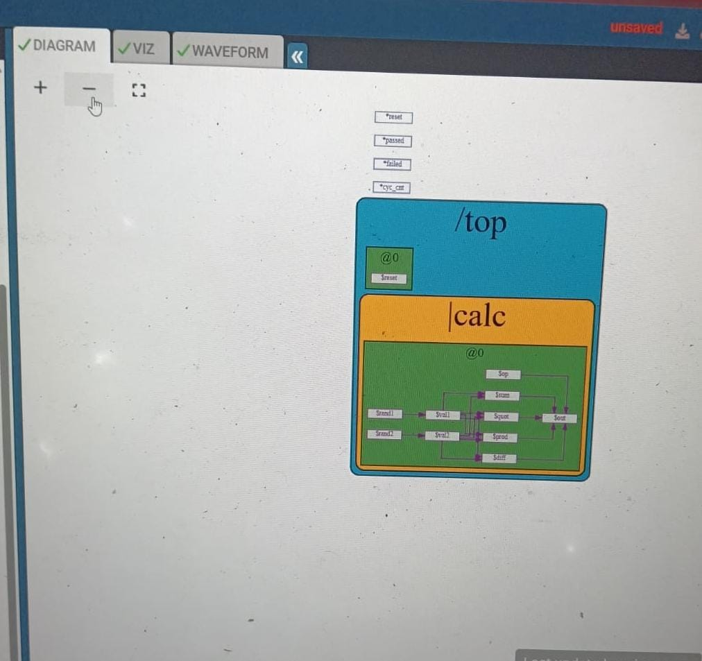

*Figure 3: Generated hardware diagram showing the structural representation of the combinational logic.*

---

### 4. TL-Verilog Implementation

The fourth image shows the **TL-Verilog source code** implementation in the Makerchip editor.

The design performs parallel calculations inside the `|calc` pipeline scope at stage `@0` and selects the result using conditional multiplexer logic:

```tlv
\TLV
   |calc
      @0
         $val1[31:0] =$rand1[3:0];
         $val2[31:0] =$rand2[3:0];

         $sum[31:0]  = $val1 +$val2;
         $diff[31:0] = $val1 -$val2;
         $prod[31:0] = $val1 * $val2;
         $quot[31:0] =$val2 == 0 ? 32'd0 : $val1 / $val2;

         $out[31:0]  =$op[1:0] == 2'b00 ? $sum  :$op[1:0] == 2'b01 ? $diff :$op[1:0] == 2'b10 ? $prod :$quot ;

         *passed = *cyc_cnt > 40;
         *failed = 1'b0;
\SV
   endmodule
```
------

# RV_D3SK3_L3_labs: Pipelined Logic in TL-Verilog

Pipelining breaks down complex combinational logic into smaller computational stages separated by sequential registers (flip-flops). This maximizes clock frequency ($F_{max}$) and overall throughput by processing multiple instructions or data transactions concurrently across consecutive clock cycles. 

In Transaction-Level Verilog (TL-Verilog), pipelining is represented natively using scope stages (`@stage_number`) and retiming operators (`>>stage_count`), eliminating the manual overhead of instantiating pipeline registers.

---

## Pipeline Architecture & RTL Implementation

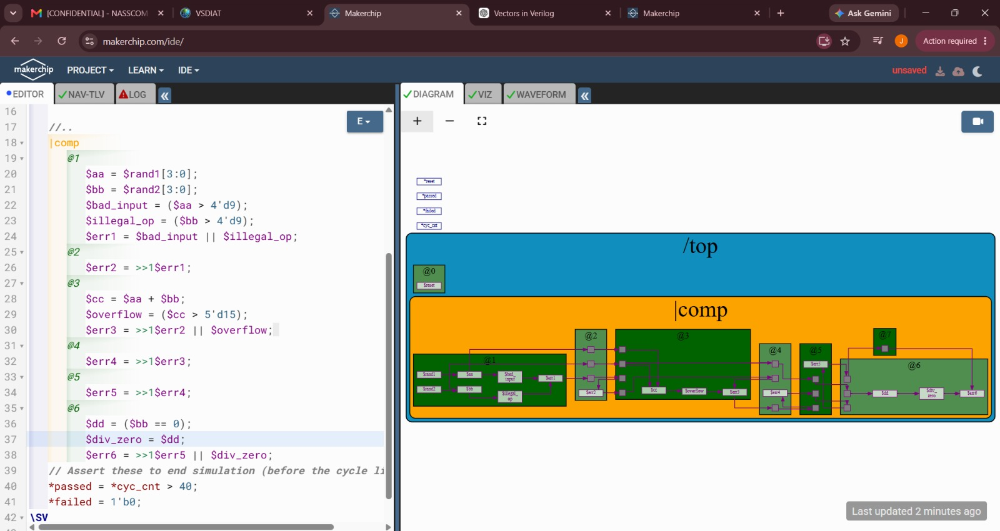

### Design & Code Structure
The logic is structured inside a 6-stage pipeline (`|comp`) that checks for mathematical validity and arithmetic errors across sequential stages:

* **Stage 1 (`@1`) — Input Validation:**
  * `$aa`, `$bb`: 4-bit pseudo-random inputs from `$rand1` and `$rand2`.
  * `$bad_input`: Asserts if `$aa > 9`.
  * `$illegal_op`: Asserts if `$bb > 9`.
  * `$err1`: Combined input error flag (`$bad_input || $illegal_op`).

* **Stage 2 (`@2`) — Error Propagation:**
  * `$err2 = >>1$err1`: Retimes `$err1` from cycle 1 into cycle 2 using a 1-cycle delay operator (`>>1`).

* **Stage 3 (`@3`) — Addition & Overflow Check:**
  * `$cc = $aa + $bb`: Computes the sum of inputs.
  * `$overflow`: Asserts if `$cc > 15`.
  * `$err3`: Accumulates previous error stage (`$err2`) with current stage overflow (`$err3 = >>1$err2 || $overflow`).

* **Stages 4 & 5 (`@4` & `@5`) — Retiming Pipeline:**
  * `$err4`, `$err5`: Pass the accumulated error signal sequentially down the pipeline (`>>1$err3`, `>>1$err4`).

* **Stage 6 (`@6`) — Division by Zero Check & Final Flags:**
  * `$dd` / `$div_zero`: Asserts if `$bb == 0`.
  * `$err6`: Computes final error status combining cycle 5 error with division-by-zero flag (`$err6 = >>1$err5 || $div_zero`).

### Visual Diagram Breakdown
The Makerchip DIAGRAM view illustrates the hierarchy under `/top`:
* **Pipeline Boundary (`|comp`):** Encapsulates the entire multi-cycle datapath.
* **Stage Blocks (`@1` to `@6`):** Highlight computational units separated by vertical register interfaces. TL-Verilog automatically infers and instantiates the internal D flip-flops between adjacent stage boundaries.

---

## Waveform Analysis & Signal Verification

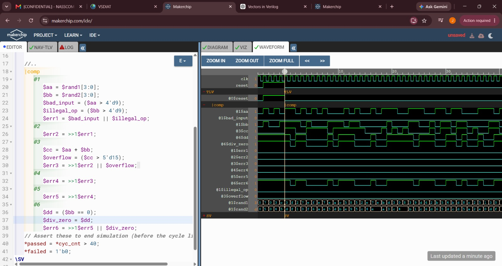

The WAVEFORM view confirms multi-cycle pipeline behavior and signal propagation:

* **Clock & Reset Dynamics:** Simulation runs under `clk` while `reset` transitions low to enable pipeline operation.
* **Cycle Latency:** Signals evaluated at stage `@1` (such as `$aa`, `$bb`, and `$err1`) advance through sequential clock cycles.
* **Error Escalation Wavefront:**
  * An error generated at stage `@1$err1` shifts into `@2$err2` on the following clock cycle.
  * At stage `@3`, `$overflow` dynamically evaluates and merges into `@3$err3`.
  * The error bit traverses stages `@4$err4` and `@5$err5` unhindered, arriving at stage `@6$err6` along with the `@6$div_zero` evaluation.
* **Randomized Testing:** `$rand1[3:0]` and `$rand2[3:0]` drive continuous data vectors through the pipeline every cycle without stalling the datapath.

  ----

# RV_D3SK4_L5_Labs: Calculator with Single-Value Memory

A single-value memory element in a pipelined calculator allows the circuit to persist calculation results across multiple execution cycles. Incorporating a memory register and recall mechanism enables multi-step arithmetic workflows without needing external data storage.

In Transaction-Level Verilog (TL-Verilog), single-value memory is implemented by extending the opcode control path and using feedback retiming (`>>2`) to dynamically hold or update state across pipeline stages.

---

## Architecture & Design Implementation

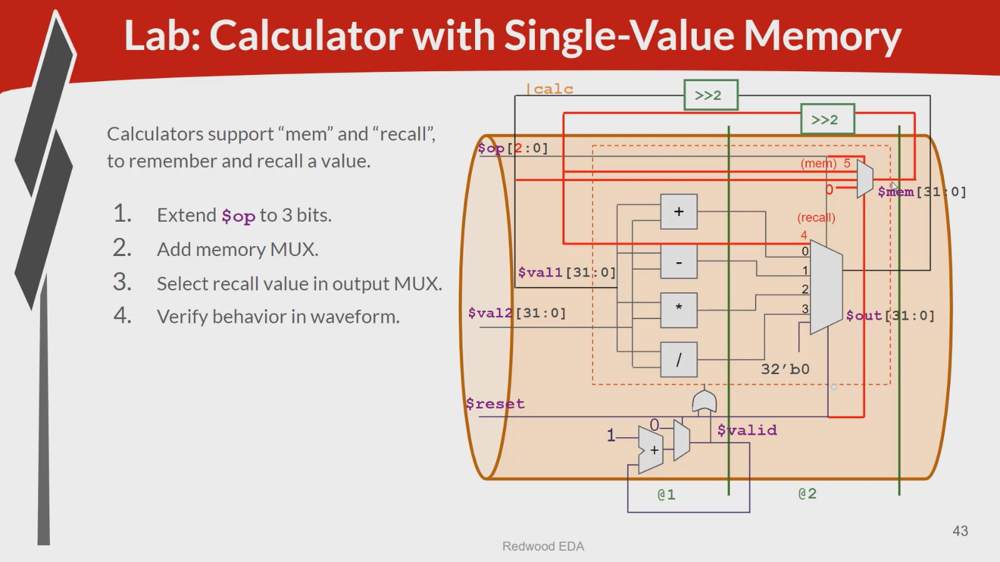

### Extended Opcode & Control Logic
The operation signal `$op` is expanded from 2 bits to 3 bits (`$op[2:0]`) to accommodate memory instructions alongside standard arithmetic operations:

* **`3'b000` (0):** Addition (`$sum`)
* **`3'b001` (1):** Subtraction (`$diff`)
* **`3'b010` (2):** Multiplication (`$prod`)
* **`3'b011` (3):** Division (`$quot`)
* **`3'b100` (4):** Memory Recall (Selects stored `$mem` value into `$out`)
* **`3'b101` (5):** Memory Store (Captures current calculated value into `$mem`)

### Memory & Pipeline Stage Breakdown

* **Stage 0 (`@0`) — Control & Reset Setup:**
  * `$valid`: Validates active execution cycles (`>>1$cnt`).
  * `$valid_or_reset`: Gating signal ensuring safe operation during reset transitions (`$valid || $reset`).

* **Stage 1 (`@1`) — Parallel Arithmetic Computation:**
  * `$sum[31:0] = $val1 + $val2`: Computes addition.
  * `$diff[31:0] = $val1 - $val2`: Computes subtraction.
  * `$prod[31:0] = $val1 * $val2`: Computes product.
  * `$quot[31:0] = $val2 ? ($val1 / $val2) : 32'b0`: Computes division with divide-by-zero protection.

* **Stage 2 (`@2`) — Output Selection & Memory Multiplexing:**
  * **Output MUX (`$out[31:0]`):** Decodes `$op[2:0]` to select between arithmetic results (`$sum`, `$diff`, `$prod`, `$quot`), the memory recall value, or defaults to `32'b0` on `$reset`.
  * **Memory Register (`$mem[31:0]`):** Implements single-value state retention using retimed feedback (`>>2`). When `$op == 3'b101` (Store), `$mem` updates with the current output; otherwise, it retains its previous state (`>>2$mem`).

---

## Visual Diagram Breakdown

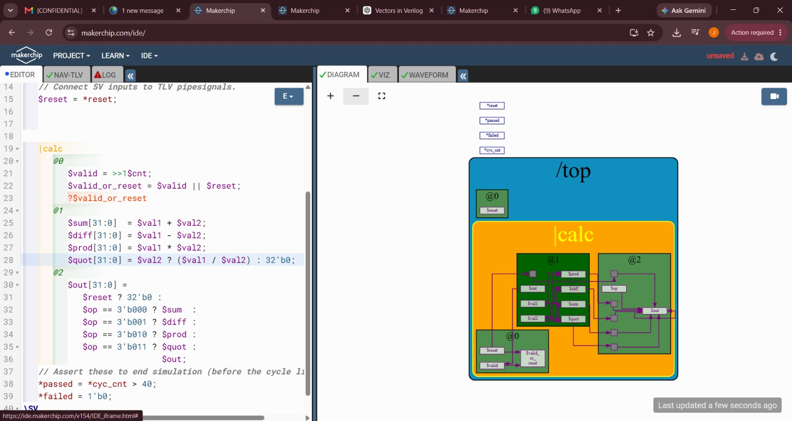

The Makerchip DIAGRAM view represents the physical layout across the `|calc` pipeline hierarchy:

* **Stage `@0` Box:** Contains reset and pipeline validity control gating (`$valid_or_reset`).
* **Stage `@1` Box:** Houses the parallel arithmetic execution blocks (`$sum`, `$diff`, `$prod`, `$quot`).
* **Stage `@2` Box:** Houses the extended multiplexer logic for `$out` and the memory holding register `$mem`, showcasing the retimed feedback loops (`>>2`) spanning across stage boundaries.

---

## Waveform Analysis & Signal Verification

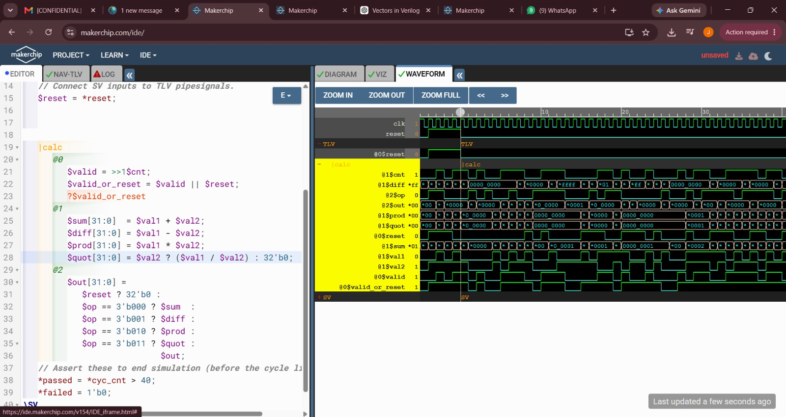

The WAVEFORM view confirms correct memory store, recall, and arithmetic operation:

* **Synchronous Reset:** While `$reset` is active high, output vectors (`$out`, `$sum`, `$diff`, etc.) remain zeroed (`32'h0000_0000`).
* **Arithmetic Execution:** As `$op` cycles through `3'b000` to `3'b011`, `$out` dynamically updates with computed results based on valid inputs `$val1` and `$val2`.
* **Memory Store & Recall Dynamics:**
  * When `$op` equals `3'b101` (Store), the corresponding output value is latched into `$mem`.
  * Subsequent cycles maintaining non-store operations keep `$mem` stable without data corruption.
  * When `$op` equals `3'b100` (Recall), `$out` instantly reflects the previously stored memory value regardless of current inputs `$val1` and `$val2`.
 
    ----

# RV_D4SK2_L2_Labs: RISC-V CPU Microarchitecture - Pipelined Calculator with Memory Array

Building scalable CPU microarchitectures requires integrating storage structures directly within the execution pipeline. In this lab, the single-value memory calculator is upgraded to a multi-slot, addressable 2D memory array (`/mem_array[7:0]`). This layout mirrors register file and data cache structures used in RISC-V core designs.

In Transaction-Level Verilog (TL-Verilog), hierarchical arrays and multi-stage pipelines are instantiated cleanly using macro definitions (`m4+solution`) and parametric array scopes, enabling modular verification and pipeline visualization.

---

## Architecture & Design Implementation

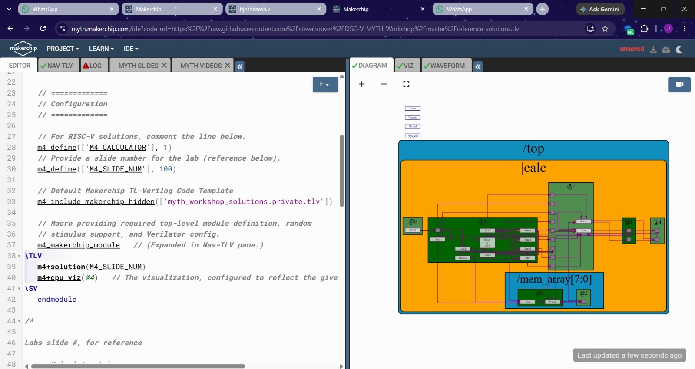

### Macro Configuration & Code Structure
The top-level testbench leverages Makerchip M4 macros to configure the target design lab (Slide 100 solution):

* **`m4_define(['M4_CALCULATOR'], 1)`:** Configures the macro environment to synthesize the advanced pipelined calculator with memory array support.
* **`m4_define(['M4_SLIDE_NUM'], 100)`:** Binds the internal pipeline stage connections to reference solution slide 100.
* **`m4+cpu_viz(@4)`:** Enables dynamic visual representation of the execution pipeline up to stage `@4`.

### Pipeline & Memory Array Hierarchy

* **Stage 0 (`@0`) — Gating & Reset Control:**
  * Establishes validity signals (`$valid`) and reset OR logic (`$reset_or_valid`) to ensure safe data flow across clock domain transitions.

* **Stage 1 (`@1`) — Parallel ALU Execution & Address Decoding:**
  * **ALU Core:** Concurrently evaluates primary arithmetic functions (`$sum`, `$diff`, `$prod`, `$quot`).
  * **Memory Sub-Hierarchy (`/mem_array[7:0]`):** Instantiates an 8-entry addressable memory array. Each entry manages its own write-enable flag (`$wr`) and array value (`$value`) across `@1` and `@2`.

* **Stage 2 (`@2`) — Multiplexing & Memory Access:**
  * Decodes the extended opcode (`$op`) to route standard ALU output, memory store operations, or indexed memory recall values directly to `$out`.

* **Stages 3 & 4 (`@3` & `@4`) — Writeback & Visualization Pipeline:**
  * Delays and registers calculated outputs to feed the CPU visualizer pipeline (`m4+cpu_viz(@4)`), laying the foundation for multi-stage RISC-V instruction commit logic.

---

## Visual Diagram Breakdown

The Makerchip DIAGRAM view illustrates the hierarchical design under `/top`:

* **Pipeline Boundary (`|calc`):** Wraps stages `@0` through `@4`, showing inter-stage retiming registers that propagate computed data down the pipeline.
* **Indexed Array Scope (`/mem_array[7:0]`):** Renders a dedicated sub-block connected to the main execution stage. It highlights individual write lines (`$wr`) and register slots (`$value`) directly interacting with the `@1` and `@2` pipeline stages.

---

## Waveform Analysis & Signal Verification

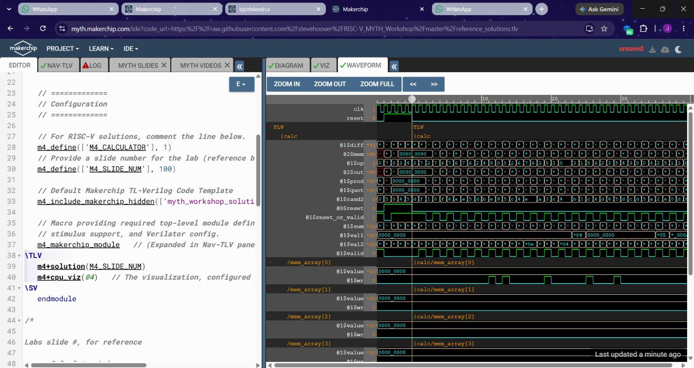

The WAVEFORM view confirms correct operation across both the main execution pipe and the memory array:

* **Pipeline Synchronization:** Operational signals (`$val1`, `$val2`, `$op`, `$sum`, `$diff`, `$prod`, `$quot`, `$out`) transition in sync with `clk` while respecting `$reset_or_valid`.
* **Memory Array Writes (`/mem_array[*]`):**
  * Individual array entries (`/mem_array[0]` through `/mem_array[3]`) reflect targeted write pulses on `$wr`.
  * When a write instruction targets a specific memory index, its corresponding `$value` signal updates cleanly on the clock edge while other entries maintain state.
* **Data Recall Integrity:** Memory recall operations read directly from the targeted `/mem_array[index]` entry, forwarding the stored value into `$out` without pipeline stalls.
